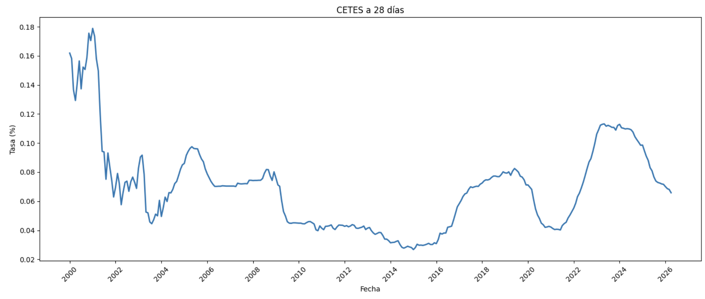
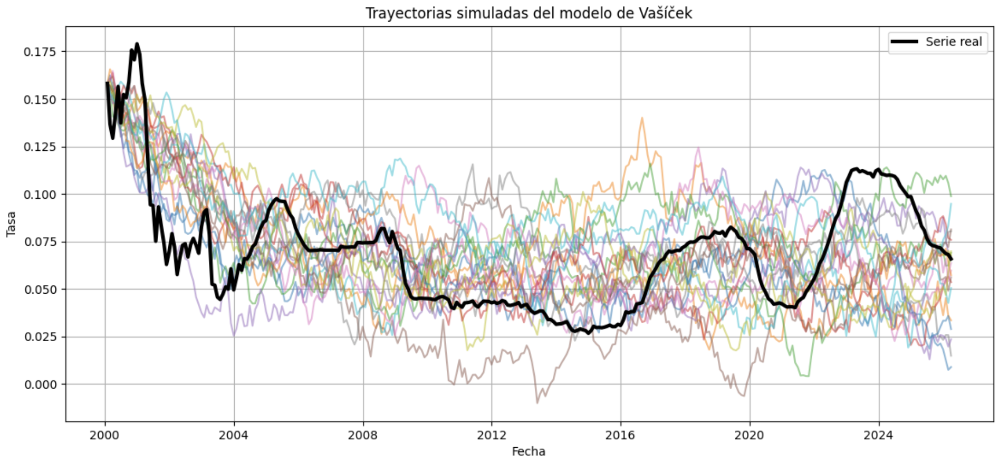
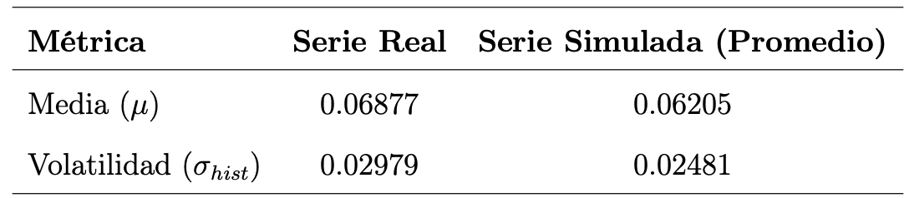

# Vasicek Interest Rate Model

Developed a complete Vasicek interest rate framework for Mexican CETES data, including parameter estimation, stochastic simulation, model validation, and financial interpretation.
---

## 🔑 Key Results
- Estimated mean reversion speed: 0.3607
- Long-term equilibrium rate: 5.87%
- Volatility parameter: 1.78%

---

## 🔍 Overview

This project studies the behavior of interest rates through the Vasicek model, a mean-reverting stochastic process widely used in quantitative finance and fixed income modeling.

The model is applied to Mexican CETES data in order to:
- Estimate model parameters.
- Analyze long-term behavior.
- Compare simulated dynamics against observed market data.

This repository was developed as an undergraduate thesis project in Actuarial Science.

---
## 🧮 Methodology

The project begins with the theoretical foundations of stochastic calculus, including Brownian motion and Itô stochastic integrals, which provide the mathematical framework for continuous-time interest rate modeling.

The Vasicek process is defined through the stochastic differential equation:

$dr_t = a(b-r_t)dt+\sigma dB_t$

Where:
* $a$: Speed of mean reversion.
* $b$: Long-term equilibrium level.
* $\sigma$: Volatility parameter.
* $W_t$: Wiener Process 

The explicit solution of the process allows the derivation of its statistical properties, including mean reversion behavior, conditional expectation, variance dynamics, and stationary distribution.

For estimation purposes, the continuous-time model is transformed into its discrete recursive representation:

$r_{t+\Delta}=u+vr_t+\eta_t$

This representation is equivalent to an AR(1) process, allowing parameter estimation through Maximum Likelihood Estimation (MLE) and Ordinary Least Squares (OLS).

After recovering the continuous-time parameters, the model is used to simulate future interest rate trajectories and analyze its ability to represent observed market dynamics.

---

## 📚 Documentation and Implementation

**Theory and Mathematical Development**  
Available in the `thesis` directory.

**Python Implementation and Simulations**  
Available in the `notebooks` directory.

---

## 📈 Results and Model Analysis

### Historical Interest Rates

The historical CETES series exhibits clear changes in volatility across different economic periods, including high-rate environments and more stable low-volatility regimes.

### Parameter Estimation

The estimated Vasicek parameters suggest the presence of mean-reverting dynamics in CETES interest rates.

- Mean reversion speed: $\hat{a}=0.3607$
- Long-term equilibrium level: $\hat{b}=0.0587$
- Volatility parameter: $\hat{\sigma}= 0.0178$

The estimated parameters capture the essential dynamics of 28-day CETES interest rates. The mean reversion speed, ( $\hat{a} = 0.3607$ ), suggests a moderate adjustment toward equilibrium after external shocks. The long-term mean, ( $\hat{b} = 5.87%\$ ), reflects the average interest rate level under stable inflation conditions, while the estimated volatility, ( $\hat{\sigma} = 0.0178$ ), indicates that stochastic fluctuations remain consistent with the model’s long-run mean-reverting behavior.

### Simulated Interest Rate Paths

Using the estimated parameters, multiple stochastic trajectories were simulated under the Vasicek framework.

The simulations reproduce the mean-reverting behavior predicted by the model while illustrating possible future interest rate scenarios.

The simulations successfully reproduce the general behavior of the observed CETES series, suggesting that the estimated parameters provide an adequate representation of the underlying interest rate dynamics. In particular, a noticeable concentration of trajectories around the interval $(0.05, 0.06)$ can be observed, indicating convergence toward the estimated long-term equilibrium level of the process.

---

## Validation 

**Moment Validation**

The simulated series presents a slightly lower mean (6.20%) and volatility (2.48%) compared to the historical data (6.88% and 2.98%). This behavior is mainly explained by the model’s mean-reverting structure and constant volatility assumption, which limit its ability to capture prolonged high-rate periods and extreme market fluctuations observed in the real CETES series.

---

### 🧠 Model Limitations

Although the Vasicek model successfully captures the mean-reverting nature of interest rates, the empirical analysis reveals important limitations.

The assumption of constant parameters and constant volatility restricts the model’s ability to represent periods of extreme market stress and abrupt volatility changes observed in real financial data.

As a result, the model provides a SIMPLIFIED approximation of market dynamics rather than a complete representation of interest rate behavior.

---

### 📑 Conclusions

The Vasicek framework provides analytical tractability and a solid introduction to continuous-time stochastic interest rate modeling.

Despite its limitations, the model offers valuable insights into:
- mean reversion dynamics,
- stochastic financial modeling,
- and parameter estimation techniques in quantitative finance.
  
This project provided a complete workflow from stochastic theory to empirical implementation, illustrating how continuous-time financial models can be estimated, validated, and applied to real market data.

---

## 🧠 Skills Demonstrated

- Stochastic Processes
- Interest Rate Modeling
- Maximum Likelihood Estimation
- Monte Carlo Simulation
- Time Series Analysis
- Quantitative Finance

---

## 🔧 Tools and technologies 

`Python` `Numpy` `Pandas` `Statsmodels` `Scipy` `Matplotlib` `Jupyter Notebook`

